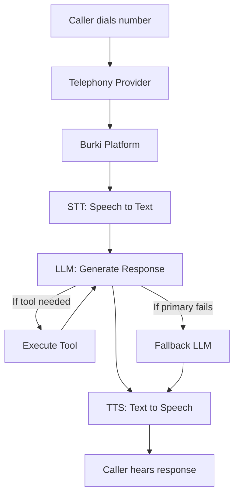
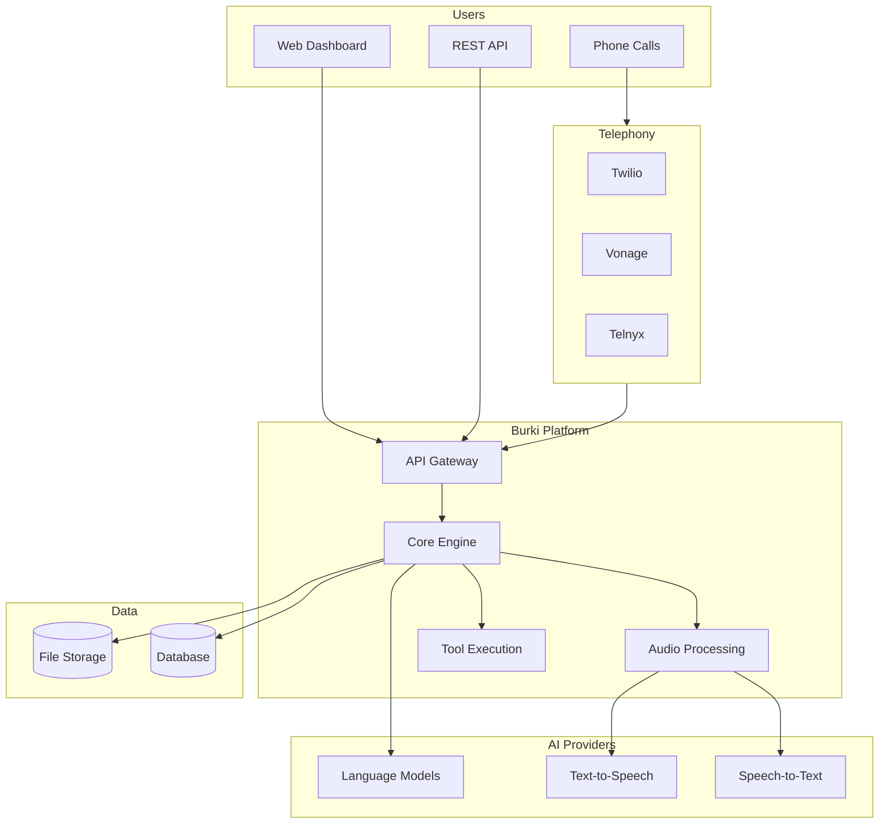

<Info>
Understanding these core concepts will help you get the most out of Burki Voice AI!
</Info>

---

## What is an Assistant?

An **Assistant** is a virtual agent that can answer calls, talk to users, and perform tasks using AI. Each assistant has its own configuration for language, voice, hearing, and integrations.

- You can create multiple assistants for different use cases (e.g., sales, support, info lines).
- Each assistant can have its own settings, phone number, and knowledge base.
- Assistants can be updated in real-time without any downtime.

---

## Multi-Tenancy & Organizations

- **Organizations:** Group your assistants, team members, and resources under one account. Great for agencies, teams, or businesses with many brands.
- **Role-Based Access:** Admins, members, and viewers each have different permissions.
- **Resource Isolation:** Each organization's data is completely separate and secure.

---

## Provider Modes

Burki offers flexibility in how you connect to AI providers:

<CardGroup cols={2}>
  <Card title="Burki Cloud" icon="cloud">
    We manage all provider connections. You select providers and models, we handle the rest.
  </Card>
  <Card title="BYO Mode" icon="key">
    Connect your own API keys. You pay providers directly and maintain full control.
  </Card>
</CardGroup>

<Accordion title="Why Flexibility Matters">
- **Cost Control:** Use your existing enterprise pricing with BYO mode
- **Try New Models:** Test new AI models as they launch
- **Optimize:** Use Burki Cloud for convenience, BYO for specific needs
- **Fallbacks:** Set up backup providers for reliability
</Accordion>

---

## How a Call Flows Through the System

When someone calls your Burki phone number, here's what happens:

### Component Breakdown

| Component | What It Does | Providers |
|-----------|-------------|-----------|
| **Telephony** | Handles phone calls and audio streaming | Twilio, Vonage, Telnyx |
| **STT** | Converts caller's speech to text | Deepgram |
| **LLM** | Understands context and generates responses | OpenAI, Anthropic, Gemini, Groq, xAI |
| **TTS** | Converts AI response back to speech | ElevenLabs, Cartesia, Deepgram, Resemble |
| **Tools** | Executes actions (transfers, API calls, etc.) | Built-in + Custom |

<Info>
You can customize every step—choose your favorite providers, set up fallbacks, and fine-tune the experience!
</Info>

---

## Configuration Sections

When setting up an assistant, you'll configure these sections:

| Section | What You Configure |
|---------|-------------------|
| **Basic Info** | Name, description, and greeting message |
| **AI Configuration** | LLM, TTS, and STT providers and models |
| **RAG (Knowledge Base)** | Documents and web pages for context |
| **Call Management** | Interruptions, recordings, and call flow |
| **Tools** | Actions your assistant can take |
| **Phone Numbers** | Which numbers route to this assistant |

---

## System Architecture

### Key Components

- **API Gateway**: Handles authentication, rate limiting, and request routing
- **Core Engine**: Manages conversation state, assistant configuration, and business logic
- **Audio Processing**: Real-time audio streaming with noise reduction
- **Tool Execution**: Secure execution environment for custom actions
- **Storage**: Encrypted storage for conversations, recordings, and configuration

---

## Data Flow

### Inbound Call

1. **Call arrives** at your phone number via telephony provider
2. **Audio streams** to Burki in real-time over WebSocket
3. **STT converts** speech to text with sub-second latency
4. **LLM generates** a contextual response
5. **TTS converts** response to audio
6. **Audio streams** back to the caller
7. **Call data** is logged for analytics and transcripts

### Outbound Call (API-Initiated)

1. **API request** triggers an outbound call
2. **Burki connects** via telephony provider
3. **Same flow** as inbound once connected
4. **Webhook** notifies your system of call status

---

## Security & Compliance

- **Encryption**: All data encrypted at rest (AES-256) and in transit (TLS 1.3)
- **API Key Security**: Keys are hashed and never stored in plain text
- **Provider Isolation**: BYO keys are encrypted and only used for your requests
- **Audit Logs**: Complete audit trail of all system access
- **Data Retention**: Configurable retention policies for recordings and transcripts

---

## Next Steps

<CardGroup cols={2}>
  <Card
    title="AI Configuration"
    icon="brain"
    href="/ai-configuration"
  >
    Learn about LLM, TTS, and STT configuration options
  </Card>
  <Card
    title="Integrations"
    icon="plug"
    href="/integrations"
  >
    Connect with external services and APIs
  </Card>
</CardGroup>
