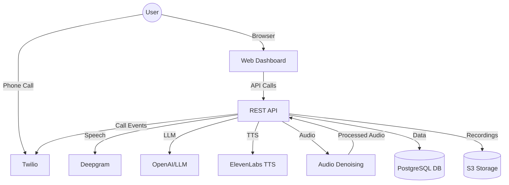

<Callout type="info">
Understanding these basics will help you get the most out of Burki Voice AI!
</Callout>

---

## What is an Assistant?

An **Assistant** is a virtual agent that can answer calls, talk to users, and perform tasks using AI. Each assistant has its own configuration for language, voice, hearing, and integrations.

- You can create multiple assistants for different use cases (e.g., sales, support, info lines).
- Each assistant can have its own settings, phone number, and knowledge base.

---

## Multi-Tenancy & Modularity

- **Multi-Tenancy:** Manage multiple organizations and assistants from a single platform. Great for agencies, teams, or businesses with many brands.
- **Modularity:** Swap out any AI provider (LLM, TTS, STT) at any time. Mix and match to get the best results for your needs.

<Accordion title="Why Modularity Matters">
- Try new AI models as they launch—no lock-in!
- Use fallback providers for reliability
- Optimize for speed, cost, or quality as needed
</Accordion>

---

## How a Call Flows Through the System

<Mermaid>
graph TD
  A[User speaks on phone] --> B[Speech-to-Text (STT)]
  B --> C[Language Model (LLM)]
  C --> D[Text-to-Speech (TTS)]
  D --> E[User hears AI response]
  C -- "If LLM fails" --> F[Fallback LLM]
  F --> D
</Mermaid>

- **STT:** Converts the caller's speech to text (e.g., Deepgram)
- **LLM:** Understands and generates a response (e.g., OpenAI, Claude, Gemini, etc.)
- **TTS:** Converts the AI's response back to speech (e.g., ElevenLabs, Deepgram, Inworld)
- **Fallbacks:** If the main LLM fails, the system automatically tries your backup providers

<Callout type="success">
You can customize every step—choose your favorite providers, set up fallbacks, and fine-tune the experience!
</Callout>

---

## Configuration Sections Overview

- **Basic Info:** Name, description, and branding
- **AI Configuration:** Pick your LLM, TTS, and STT providers and models
- **RAG (Knowledge Base):** Add custom knowledge for smarter answers
- **Call Management:** Control call flow, interruptions, and recordings
- **Integrations:** Connect Twilio, Deepgram, and more
- **Advanced:** Fine-tune settings for power users

---

# Architecture

Burki Voice AI is designed with modularity, scalability, and extensibility in mind. This page provides a high-level overview of the system architecture and codebase structure.

## System Overview



## Folder Structure

```text
app/
  core/         # Core business logic and managers
  services/     # Integrations (Twilio, Deepgram, TTS, etc.)
  api/          # REST API endpoints and web routes
  db/           # Database models and migrations
  utils/        # Utility functions and helpers
  templates/    # Web interface templates (HTML)
  static/       # Static assets (CSS, images, etc.)
  twilio/       # Twilio-specific logic
  rag/          # Retrieval-Augmented Generation (RAG) modules
  creator/      # Creator tools and services
  tools/        # Custom tools and scripts
```

## Component Interaction
- **Web Dashboard**: Allows users to manage assistants, view analytics, and configure settings via a modern UI.
- **API Layer**: Handles all RESTful requests, authentication, and business logic.
- **Telephony (Twilio)**: Receives and manages phone calls, streams audio to the backend.
- **Speech-to-Text (Deepgram)**: Transcribes incoming audio in real time.
- **LLM (OpenAI, etc.)**: Generates intelligent responses based on transcribed text.
- **Text-to-Speech (ElevenLabs, etc.)**: Converts responses to natural-sounding speech.
- **Audio Denoising**: Cleans up audio streams for better recognition and user experience.
- **Database**: Stores user, assistant, call, and analytics data.
- **S3 Storage**: Stores call recordings and large audio files.

<Callout type="info">
For more details on each integration, see the [Integrations](integrations) page.
</Callout> 