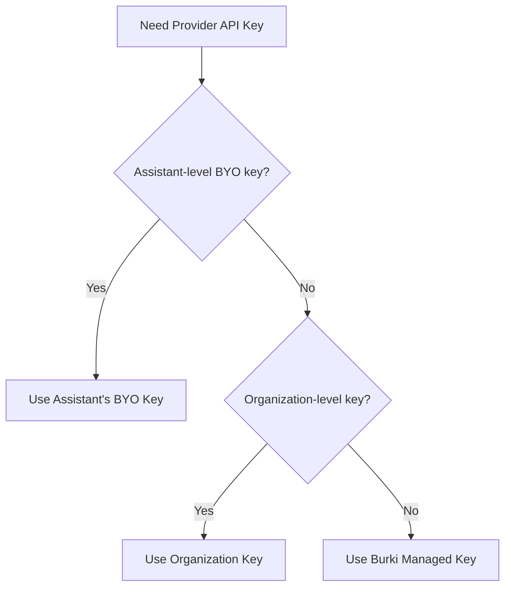

<Callout type="info">
Bring Your Own (BYO) API Keys lets you use your own provider accounts for TTS, STT, and LLM services. Control costs directly with your provider, leverage enterprise agreements, and maintain full billing transparency.
</Callout>

---

## Overview

BYO API Keys gives you flexibility in how you pay for AI services:

<CardGroup cols={3}>
  <Card title="Cost Control" icon="dollar-sign">
    Pay your providers directly at your negotiated rates.
  </Card>
  
  <Card title="Enterprise Agreements" icon="handshake">
    Use existing volume discounts or enterprise contracts.
  </Card>
  
  <Card title="Per-Assistant Flexibility" icon="sliders">
    Mix managed and BYO keys across different assistants.
  </Card>
</CardGroup>

---

## How It Works

When a call uses a provider service, Burki checks for API keys in this order:



1. **Assistant-level BYO keys** (highest priority)
2. **Organization-level credentials**
3. **System default keys** (Burki managed)

This allows you to use BYO keys for specific assistants while others use managed keys.

---

## Supported Providers

Configure BYO keys for the following providers:

| Provider | Service | Required Fields |
|----------|---------|-----------------|
| **ElevenLabs** | TTS | `api_key` |
| **Deepgram** | STT, TTS | `api_key` |
| **Cartesia** | TTS | `api_key` |
| **OpenAI** | TTS, LLM | `api_key` |
| **Azure Speech** | TTS, STT | `api_key`, `region` |
| **Inworld** | TTS | `bearer_token`, `workspace_id` |
| **Resemble AI** | TTS | `api_key` |

---

## Configuration

### TTS Provider Keys

Add BYO keys in your assistant's TTS settings:

<Tabs>
  <Tab title="ElevenLabs">
    ```json
    {
      "tts_settings": {
        "provider": "elevenlabs",
        "byo_api_keys": {
          "elevenlabs": {
            "api_key": "your-elevenlabs-api-key"
          }
        }
      }
    }
    ```
  </Tab>
  <Tab title="Deepgram">
    ```json
    {
      "tts_settings": {
        "provider": "deepgram",
        "byo_api_keys": {
          "deepgram": {
            "api_key": "your-deepgram-api-key"
          }
        }
      }
    }
    ```
  </Tab>
  <Tab title="Cartesia">
    ```json
    {
      "tts_settings": {
        "provider": "cartesia",
        "byo_api_keys": {
          "cartesia": {
            "api_key": "your-cartesia-api-key"
          }
        }
      }
    }
    ```
  </Tab>
  <Tab title="OpenAI">
    ```json
    {
      "tts_settings": {
        "provider": "openai",
        "byo_api_keys": {
          "openai": {
            "api_key": "your-openai-api-key"
          }
        }
      }
    }
    ```
  </Tab>
</Tabs>

### STT Provider Keys

Add BYO keys in your assistant's STT settings:

```json
{
  "stt_settings": {
    "provider": "deepgram",
    "byo_api_keys": {
      "deepgram": {
        "api_key": "your-deepgram-api-key"
      }
    }
  }
}
```

### Azure Speech (Special Configuration)

Azure Speech requires both an API key and a region:

```json
{
  "tts_settings": {
    "provider": "azure",
    "byo_api_keys": {
      "azure": {
        "api_key": "your-azure-speech-key",
        "region": "eastus"
      }
    }
  }
}
```

<Callout type="warning">
Azure region must match where your Speech resource is deployed. Common regions: `eastus`, `westus2`, `westeurope`, `southeastasia`.
</Callout>

### Inworld (Bearer Token)

Inworld uses a bearer token and workspace ID:

```json
{
  "tts_settings": {
    "provider": "inworld",
    "byo_api_keys": {
      "inworld": {
        "bearer_token": "your-inworld-bearer-token",
        "workspace_id": "your-workspace-id"
      }
    }
  }
}
```

---

## Dashboard Configuration

<Steps>
  <Step title="Open Assistant Settings">
    Navigate to your assistant's configuration page.
  </Step>
  <Step title="Go to Voice Settings">
    Find the TTS or STT configuration section.
  </Step>
  <Step title="Enable BYO Keys">
    Toggle "Use my own API key" or similar option.
  </Step>
  <Step title="Enter Credentials">
    Paste your API key (and region if required).
  </Step>
  <Step title="Save and Test">
    Save settings and make a test call to verify.
  </Step>
</Steps>

---

## Security

Your API keys are protected with enterprise-grade security:

<Accordion title="Encryption at Rest">
All API keys are encrypted using AES-256 encryption before storage. Keys are decrypted only when needed for API calls and never stored in plaintext.
</Accordion>

<Accordion title="Never Exposed in API">
BYO API keys are never returned in API responses. When you retrieve assistant settings, key fields show masked values like `***...***` or are omitted entirely.
</Accordion>

<Accordion title="Audit Logging">
Key usage is logged for security auditing:
- When keys are added or updated
- Which services use which keys
- Failed authentication attempts
</Accordion>

<Accordion title="Secure Transmission">
All API calls using your keys are made over HTTPS/TLS 1.3. Keys are transmitted securely to provider endpoints.
</Accordion>

---

## Cost Implications

<Tabs>
  <Tab title="BYO Keys">
    **You pay the provider directly:**
    - Direct billing from ElevenLabs, Deepgram, etc.
    - Your negotiated rates apply
    - No markup from Burki on provider costs
    - Burki charges only platform fees
    
    **Best for:**
    - High volume usage
    - Existing enterprise agreements
    - Organizations requiring direct vendor relationships
  </Tab>
  <Tab title="Managed Keys">
    **Burki provides and bills:**
    - Pass-through costs + 15% markup
    - Single invoice from Burki
    - No need to manage multiple vendor accounts
    - Included usage tracking and analytics
    
    **Best for:**
    - Getting started quickly
    - Lower volume usage
    - Simplified billing
  </Tab>
  <Tab title="Hybrid">
    **Mix and match:**
    - Use BYO keys for high-volume providers
    - Use managed for occasional services
    - Different settings per assistant
    
    **Example:**
    - BYO: ElevenLabs (high TTS volume)
    - Managed: Deepgram STT (lower volume)
  </Tab>
</Tabs>

---

## Testing Your Keys

After configuring BYO keys, verify they work:

### Quick Test

1. Make a test call to your assistant
2. Check the call logs for provider usage
3. Verify the call completed successfully
4. Check your provider dashboard for the corresponding API call

### Common Issues

<Accordion title="Invalid API Key">
**Symptom:** Calls fail immediately or fall back to managed keys

**Solution:**
- Verify the key is correct (no extra spaces)
- Check key hasn't expired
- Confirm key has required permissions
- Ensure key is for the correct environment (production vs. sandbox)
</Accordion>

<Accordion title="Wrong Region (Azure)">
**Symptom:** Azure calls fail with region errors

**Solution:**
- Match region exactly to your Azure Speech resource
- Use lowercase (e.g., `eastus` not `East US`)
- Check Azure portal for the correct region name
</Accordion>

<Accordion title="Rate Limiting">
**Symptom:** Some calls succeed, others fail

**Solution:**
- Check your provider's rate limits
- Upgrade your provider plan if needed
- Consider spreading load across multiple keys
</Accordion>

<Accordion title="Insufficient Permissions">
**Symptom:** Specific operations fail

**Solution:**
- Verify API key has access to required services
- For ElevenLabs: Ensure voice cloning permissions if using cloned voices
- For Deepgram: Check STT and TTS are both enabled if using both
</Accordion>

---

## Provider Setup Guides

<Accordion title="ElevenLabs">
1. Log in to [ElevenLabs](https://elevenlabs.io)
2. Go to **Profile** > **API Keys**
3. Create a new API key or copy existing
4. Ensure your plan supports the voices you want to use

**Permissions needed:** Text-to-Speech generation
</Accordion>

<Accordion title="Deepgram">
1. Log in to [Deepgram Console](https://console.deepgram.com)
2. Go to **API Keys**
3. Create a new key with STT and/or TTS permissions
4. Copy the key (shown only once)

**Permissions needed:** `listen` for STT, `speak` for TTS
</Accordion>

<Accordion title="Cartesia">
1. Log in to [Cartesia](https://play.cartesia.ai)
2. Navigate to API settings
3. Generate a new API key
4. Copy and store securely

**Permissions needed:** Speech synthesis
</Accordion>

<Accordion title="Azure Speech">
1. Log in to [Azure Portal](https://portal.azure.com)
2. Create or navigate to your Speech resource
3. Go to **Keys and Endpoint**
4. Copy Key 1 or Key 2
5. Note the region (e.g., `eastus`)

**Permissions needed:** Speech Services access
</Accordion>

<Accordion title="OpenAI">
1. Log in to [OpenAI Platform](https://platform.openai.com)
2. Go to **API Keys**
3. Create a new secret key
4. Copy immediately (not shown again)

**Permissions needed:** Model access for TTS models (tts-1, tts-1-hd)
</Accordion>

---

## Best Practices

- **Rotate keys periodically**: Update API keys every 90 days for security
- **Use separate keys**: Create dedicated keys for Burki rather than sharing with other applications
- **Monitor usage**: Check provider dashboards regularly for unexpected usage
- **Set up alerts**: Configure billing alerts with your providers
- **Test after changes**: Always verify calls work after updating keys
- **Keep backups**: Store keys securely in a password manager

<Callout type="tip">
When testing BYO keys, start with a low-volume assistant before rolling out to production traffic. This catches configuration issues without impacting critical workloads.
</Callout>

---

## API Reference

### Setting BYO Keys via API

```bash
curl -X PUT "https://api.burki.dev/api/v1/assistants/{assistant_id}" \
  -H "Authorization: Bearer YOUR_API_KEY" \
  -H "Content-Type: application/json" \
  -d '{
    "tts_settings": {
      "provider": "elevenlabs",
      "byo_api_keys": {
        "elevenlabs": {
          "api_key": "your-elevenlabs-key"
        }
      }
    },
    "stt_settings": {
      "provider": "deepgram",
      "byo_api_keys": {
        "deepgram": {
          "api_key": "your-deepgram-key"
        }
      }
    }
  }'
```

### Removing BYO Keys

To revert to managed keys, set `byo_api_keys` to `null` or an empty object:

```bash
curl -X PUT "https://api.burki.dev/api/v1/assistants/{assistant_id}" \
  -H "Authorization: Bearer YOUR_API_KEY" \
  -H "Content-Type: application/json" \
  -d '{
    "tts_settings": {
      "byo_api_keys": null
    }
  }'
```

<Callout type="note">
BYO keys are not included in assistant export/import to prevent accidental key exposure. Re-enter keys after importing an assistant.
</Callout>
