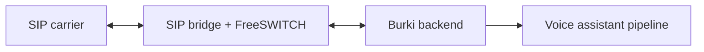

BYO SIP trunking lets you connect carrier trunks directly to Burki while still using Burki assistants, routing, transcripts, recordings, billing, and observability.

## Architecture



The bridge handles SIP signaling and audio adaptation. Burki handles assistant lookup, call state, streaming, transcripts, and AI orchestration.

## When to Use BYO SIP

- You already have carrier contracts or number inventory.
- You need SIP-level control over routing, failover, or origination.
- You want a self-hosted or hybrid telephony path.
- You need to keep carrier billing outside Burki managed carrier costs.

## Setup Flow

<Steps>
  <Step title="Create SIP trunks">
    Add one or more trunks through the SIP Trunks API or dashboard. Each trunk includes gateway, username, password, priority, enabled status, and registration behavior.
  </Step>
  <Step title="Sync to SIP bridge">
    Burki pushes enabled trunk configuration to the SIP bridge. The bridge generates FreeSWITCH gateway config and reloads SIP profiles.
  </Step>
  <Step title="Assign numbers">
    Assign organization phone numbers to the relevant `sip_trunk_id` so outbound calls and routing resolve the correct carrier path.
  </Step>
  <Step title="Test calls">
    Place inbound and outbound test calls, then inspect call logs, transcripts, recordings, and SIP bridge logs.
  </Step>
</Steps>

## PBX Network Setup

For the current hosted SIP bridge, configure your PBX/carrier to talk to Burki at:

```text
Burki SIP bridge IP: 52.21.157.171
SIP signaling: UDP/TCP 5060
SIP TLS: TCP 5061, if your trunk uses TLS
RTP media: UDP 10000-20000
```

<Warning>
Allowlist `52.21.157.171` on your PBX firewall and SIP ACLs for both signaling and media. Do not expose your PBX to all public SIP traffic if your PBX supports source IP restrictions.
</Warning>

| Direction | PBX/Carrier Requirement | Burki Requirement |
|-----------|-------------------------|-------------------|
| Inbound calls to Burki | Send INVITEs to `52.21.157.171:5060` or your assigned bridge address. Allow RTP from `52.21.157.171` on UDP `10000-20000`. | Phone number must exist in Burki and be assigned to an assistant or flow. |
| Outbound calls from Burki | Accept SIP INVITEs and RTP from `52.21.157.171`. If Burki registers to your PBX, allow the configured SIP username from this bridge IP. | SIP trunk `gateway` should be your PBX/carrier host and port, such as `pbx.example.com:5060` or `138.197.131.209:6061`. |
| Registration-based trunks | Enable registration on the PBX for the username/password you give Burki. | Set `register: true` on the SIP trunk. |
| IP-auth trunks | Allow `52.21.157.171` as a trusted peer. | Set `register: false` and configure the gateway host/IP. |

Example PBX-facing trunk record:

```json
{
  "name": "Customer PBX",
  "gateway": "138.197.131.209:6061",
  "username": "9228",
  "password": "sip-password",
  "priority": 1,
  "enabled": true,
  "register": true,
  "provider": "freepbx"
}
```

In this example, Burki registers to the customer's PBX at `138.197.131.209:6061` with username `9228`, while the customer's PBX sends inbound calls to Burki at `52.21.157.171:5060`.

## Multiple DIDs on One PBX Extension

Burki routes calls by the real called phone number, not by short extension digits alone. Forwarding many numbers to one PBX extension works only if the PBX preserves the original called DID in SIP signaling.

When a PBX forwards several DIDs to one extension, ask it to include one of these headers on the INVITE to Burki:

| Header / Field | Purpose |
|----------------|---------|
| `Diversion` | Preferred for forwarded calls; include the original called DID. |
| `History-Info` | Standard history header that can carry the original called number. |
| `X-Original-Called`, `X-Original-Number`, `X-Forwarded-To`, or `X-Original-To` | Accepted custom headers for PBX-specific setups. |
| `P-Called-Party-ID` | Accepted when the carrier/PBX uses this to preserve called-party identity. |
| Request-URI or `To` user | Also works if the PBX sends the real E.164 DID instead of only the short extension. |

Example forwarded INVITE target that works:

```text
INVITE sip:9228@52.21.157.171:5060
Diversion: <sip:+16478491000@pbx.example.com>;reason=unconditional
```

Without one of those headers, a call that arrives only as `sip:9228@52.21.157.171` is ambiguous once more than one Burki number is assigned behind that extension. Burki will not guess between multiple assigned DIDs because guessing can send the caller to the wrong AI agent.

For FreePBX, enable Diversion/History-Info or add a custom header on each inbound route before forwarding to the Burki trunk. After the PBX sends a test call, Burki support can confirm whether the original DID is visible in the captured INVITE.

## Routing and Failover

SIP trunks have a `priority` field. Lower values are preferred first. Disable a trunk to remove it from routing without deleting credentials.

```json
{
  "name": "Primary Carrier",
  "gateway": "sip.example-carrier.com",
  "username": "sip-user",
  "password": "sip-password",
  "priority": 1,
  "enabled": true,
  "register": true,
  "provider": "example-carrier"
}
```

## Bridge Sync

The backend syncs organization SIP config to the bridge using:

```text
POST {SIP_BRIDGE_URL}/api/sync-organization
Authorization: Bearer {SIP_BRIDGE_API_KEY}
```

The bridge stores/generated gateway configuration and reloads FreeSWITCH. A successful API response from Burki means the org config was updated and sync was attempted; check bridge logs for FreeSWITCH reload failures.

## API References

- [SIP Trunks API](/api-reference/sip-trunks/overview)
- [SIP Webhooks and Prewarm](/api-reference/webhooks/sip-webhooks)
- [Organization phone numbers](/api-reference/organization/list-phonenumbers)

## Troubleshooting

| Symptom | Check |
|---------|-------|
| Trunk does not register | Gateway, username/password, `register`, bridge FreeSWITCH logs |
| Calls route through the wrong carrier | Phone number `sip_trunk_id`, trunk `priority`, enabled status |
| Sync succeeds but calls fail | Bridge reload logs, generated gateway XML, carrier ACL/auth rules |
| Audio format issues | SIP bridge audio adapter logs and codec settings |
