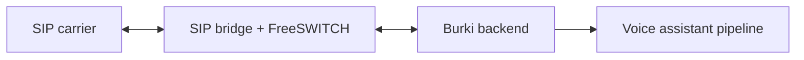

BYO SIP trunking lets you connect carrier trunks directly to Burki while still using Burki assistants, routing, transcripts, recordings, billing, and observability.

## Architecture



The bridge handles SIP signaling and audio adaptation. Burki handles assistant lookup, call state, streaming, transcripts, and AI orchestration.

## When to Use BYO SIP

- You already have carrier contracts or number inventory.
- You need SIP-level control over routing, failover, or origination.
- You want a self-hosted or hybrid telephony path.
- You need to keep carrier billing outside Burki managed carrier costs.

## Setup Flow

<Steps>
  <Step title="Create SIP trunks">
    Add one or more trunks through the SIP Trunks API or dashboard. Each trunk includes gateway, username, password, priority, enabled status, and registration behavior.
  </Step>
  <Step title="Sync to SIP bridge">
    Burki pushes enabled trunk configuration to the SIP bridge. The bridge generates FreeSWITCH gateway config and reloads SIP profiles.
  </Step>
  <Step title="Assign numbers">
    Assign organization phone numbers to the relevant `sip_trunk_id` so outbound calls and routing resolve the correct carrier path.
  </Step>
  <Step title="Test calls">
    Place inbound and outbound test calls, then inspect call logs, transcripts, recordings, and SIP bridge logs.
  </Step>
</Steps>

## Routing and Failover

SIP trunks have a `priority` field. Lower values are preferred first. Disable a trunk to remove it from routing without deleting credentials.

```json
{
  "name": "Primary Carrier",
  "gateway": "sip.example-carrier.com",
  "username": "sip-user",
  "password": "sip-password",
  "priority": 1,
  "enabled": true,
  "register": true,
  "provider": "example-carrier"
}
```

## Bridge Sync

The backend syncs organization SIP config to the bridge using:

```text
POST {SIP_BRIDGE_URL}/api/sync-organization
Authorization: Bearer {SIP_BRIDGE_API_KEY}
```

The bridge stores/generated gateway configuration and reloads FreeSWITCH. A successful API response from Burki means the org config was updated and sync was attempted; check bridge logs for FreeSWITCH reload failures.

## API References

- [SIP Trunks API](/api-reference/sip-trunks/overview)
- [SIP Webhooks and Prewarm](/api-reference/webhooks/sip-webhooks)
- [Organization phone numbers](/api-reference/organization/list-phonenumbers)

## Troubleshooting

| Symptom | Check |
|---------|-------|
| Trunk does not register | Gateway, username/password, `register`, bridge FreeSWITCH logs |
| Calls route through the wrong carrier | Phone number `sip_trunk_id`, trunk `priority`, enabled status |
| Sync succeeds but calls fail | Bridge reload logs, generated gateway XML, carrier ACL/auth rules |
| Audio format issues | SIP bridge audio adapter logs and codec settings |
