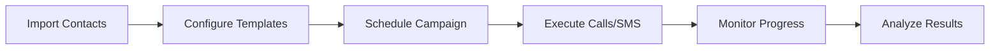
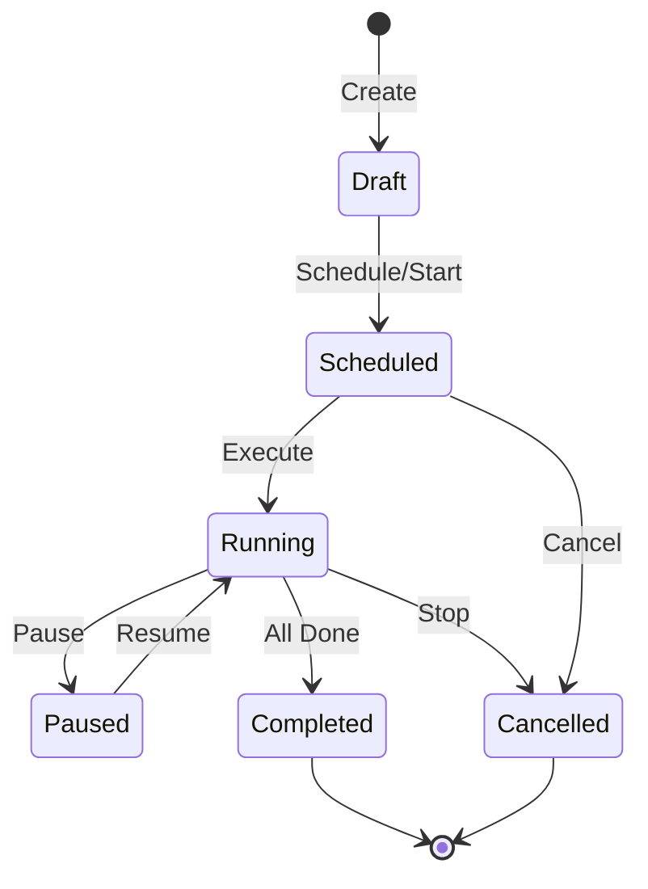

<Callout type="info">
Campaign Management allows you to automate outbound voice calls and SMS messaging at scale. Create personalized campaigns with your AI assistant, import contacts, schedule execution, and monitor progress in real-time.
</Callout>

---

## What are Campaigns?

A **Campaign** is an automated outreach system that connects your AI assistant with a list of contacts. Campaigns can:

- Make **outbound voice calls** with your AI assistant
- Send **bulk SMS messages** with personalized content
- Combine both for **mixed campaigns**

Each contact receives a personalized experience using template variables from your imported data.



---

## Campaign Types

<Accordion title="Call Campaigns">
**Outbound voice calling** with your AI assistant.

- AI makes calls to each contact in your list
- Personalized welcome messages and conversation flow
- Handles voicemail detection automatically
- Records calls and generates transcripts

**Best for:** Appointment reminders, sales outreach, customer follow-ups, surveys
</Accordion>

<Accordion title="SMS Campaigns">
**Bulk SMS messaging** with personalized content.

- Send templated SMS messages to contacts
- Supports variable substitution for personalization
- Track delivery status and responses

**Best for:** Promotional messages, appointment confirmations, notifications
</Accordion>

<Accordion title="Mixed Campaigns">
**Combines voice and SMS** for comprehensive outreach.

- Start with a call, follow up with SMS (or vice versa)
- Different messaging per channel
- Unified tracking and analytics

**Best for:** Multi-touch outreach, lead nurturing, complex workflows
</Accordion>

---

## Contact Management

### Importing Contacts

Import your contacts from CSV or JSON files. The system automatically:

- Validates phone number formats (converts to E.164)
- Detects duplicate contacts
- Maps columns to contact fields
- Extracts variables for templating

**Supported Formats:**
- **CSV**: Comma-separated values with header row
- **JSON**: Array of contact objects

<Accordion title="CSV Import Example">
Your CSV should have headers that map to contact fields:

```csv
phone_number,name,company,appointment_date
+15551234567,John Smith,Acme Corp,2024-02-15
+15559876543,Jane Doe,Tech Inc,2024-02-16
```

**Required columns:**
- `phone_number` (or `phone`, `mobile`, `cell`)

**Recommended columns:**
- `name` (or `full_name`, `contact_name`)
- Any custom fields for template variables
</Accordion>

<Accordion title="Column Mapping">
The system suggests mappings based on column names:

| CSV Column | Maps To |
|------------|---------|
| phone, phone_number, mobile | `phone_number` |
| name, full_name, contact_name | `name` |
| email, email_address | `email` |
| company, organization | `company` |

Custom columns become template variables automatically.
</Accordion>

### Contact Statuses

| Status | Description |
|--------|-------------|
| `pending` | Waiting to be contacted |
| `in_progress` | Currently being contacted |
| `completed` | Successfully contacted |
| `failed` | Contact attempt failed |
| `no_answer` | Call not answered |
| `busy` | Line was busy |
| `voicemail` | Reached voicemail |
| `skipped` | Skipped (DNC list, etc.) |

---

## Template System

Campaigns use **Jinja2-style templating** for personalized messages. Variables from your contact data are automatically available.

### Variable Syntax

Use double curly braces to insert variables:

```text
Hi {{name}}, this is {{assistant_name}} from {{company}}.
```

### Built-in Filters

| Filter | Description | Example |
|--------|-------------|---------|
| `phone_format` | Format phone numbers | `{{phone_number\|phone_format}}` |
| `title_case` | Capitalize words | `{{name\|title_case}}` |
| `upper` | UPPERCASE | `{{company\|upper}}` |
| `lower` | lowercase | `{{email\|lower}}` |

### System Variables

These variables are always available:

| Variable | Description |
|----------|-------------|
| `assistant_name` | Name of your AI assistant |
| `company` | Your company name |
| `name` | Contact's name (falls back to "there") |

### Fallback Values

Define fallback values for missing variables:

```json
{
  "fallback_values": {
    "name": "there",
    "company": "our company",
    "appointment_time": "your scheduled time"
  }
}
```

### Template Types

| Template | Used For |
|----------|----------|
| `welcome_message_template` | Opening message when call connects |
| `agenda_template` | Purpose/agenda of the call |
| `end_call_message_template` | Closing message |
| `sms_message_template` | SMS message content |

<Accordion title="Template Example">
**Welcome Message:**
```text
Hi {{name|title_case}}, this is {{assistant_name}} calling from {{company}}. 
I'm reaching out about your appointment on {{appointment_date}}.
```

**With fallbacks:**
```text
Hi {{name|default('there')}}, this is {{assistant_name}} from {{company|default('our team')}}.
```
</Accordion>

---

## Scheduling

Campaigns support flexible scheduling options:

### Schedule Types

<Accordion title="Immediate">
Campaign starts execution right away when you click "Start".

```json
{
  "schedule_type": "immediate"
}
```
</Accordion>

<Accordion title="Scheduled (Once)">
Campaign runs at a specific date and time.

```json
{
  "schedule_type": "scheduled",
  "scheduled_at": "2024-02-15T09:00:00Z",
  "timezone": "America/New_York"
}
```
</Accordion>

<Accordion title="Recurring">
Campaign runs on a repeating schedule.

```json
{
  "schedule_type": "recurring",
  "recurring_config": {
    "frequency": "weekly",
    "interval": 1,
    "days_of_week": [1, 2, 3, 4, 5],
    "time": "09:00",
    "time_zone": "America/New_York",
    "end_date": "2024-12-31"
  }
}
```

**Frequency options:** `daily`, `weekly`, `monthly`
</Accordion>

### Time Windows

Respect calling hours by configuring allowed time windows:

```json
{
  "execution_settings": {
    "allowed_hours": {
      "start": "09:00",
      "end": "17:00",
      "days": ["monday", "tuesday", "wednesday", "thursday", "friday"]
    },
    "time_zone": "America/New_York"
  }
}
```

---

## Execution Settings

Control how your campaign executes:

| Setting | Description | Default |
|---------|-------------|---------|
| `max_attempts` | Maximum call attempts per contact | 3 |
| `retry_delay_minutes` | Wait time between retries | 30 |
| `concurrent_limit` | Max simultaneous calls | 5 |
| `rate_limit_per_minute` | Max calls initiated per minute | 10 |

### Voicemail Detection (AMD)

For call campaigns, enable automatic voicemail detection:

```json
{
  "advanced_settings": {
    "enable_voicemail_detection": true,
    "leave_voicemail": true,
    "voicemail_message": "Hi {{name}}, this is {{assistant_name}}. Please call us back at..."
  }
}
```

---

## Monitoring & Analytics

### Real-Time Progress

Monitor your campaign in real-time via WebSocket or REST API:

- **Total contacts** - Number of contacts in campaign
- **Completed** - Successfully contacted
- **Failed** - Contact attempts that failed
- **Pending** - Waiting to be contacted
- **Processing** - Currently being contacted

### WebSocket Updates

Connect to the WebSocket endpoint for live updates:

```javascript
const ws = new WebSocket(`wss://api.burki.dev/ws/campaigns/${campaignId}/progress?token=${apiKey}`);

ws.onmessage = (event) => {
  const data = JSON.parse(event.data);
  if (data.type === 'progress_update') {
    console.log(`Progress: ${data.data.progress.completed}/${data.data.progress.total_contacts}`);
  }
};
```

### Metrics

| Metric | Description |
|--------|-------------|
| `completion_rate` | Percentage of contacts processed |
| `success_rate` | Successful contacts / total attempted |
| `answer_rate` | Calls answered / total calls made |
| `average_duration` | Average call duration (seconds) |
| `total_cost` | Estimated total cost |

---

## Campaign Lifecycle



| Status | Description |
|--------|-------------|
| `draft` | Campaign created, not yet started |
| `scheduled` | Campaign scheduled for future execution |
| `running` | Campaign actively executing |
| `paused` | Campaign paused, can resume |
| `completed` | All contacts processed |
| `cancelled` | Campaign stopped before completion |
| `failed` | Campaign encountered fatal error |

---

## Best Practices

<Accordion title="Compliance (TCPA, GDPR)">
- Only contact people who have opted in
- Respect Do-Not-Call lists
- Call during reasonable hours (typically 8 AM - 9 PM local time)
- Provide opt-out mechanisms
- Keep records of consent
</Accordion>

<Accordion title="Optimal Scheduling">
- **Best days:** Tuesday through Thursday
- **Best times:** 10 AM - 12 PM, 2 PM - 4 PM local time
- Avoid Monday mornings and Friday afternoons
- Consider your audience's timezone
</Accordion>

<Accordion title="Template Design">
- Keep messages concise and clear
- Personalize with contact data
- Set appropriate fallback values
- Test templates before launching
- Use professional, conversational tone
</Accordion>

<Accordion title="Performance Optimization">
- Start with lower concurrent limits and increase gradually
- Monitor answer rates to optimize timing
- Use retry logic for no-answers
- Segment contacts for targeted campaigns
</Accordion>

---

## Quick Start

1. **Create a campaign** with your assistant and campaign type
2. **Import contacts** from CSV or JSON
3. **Configure templates** with personalization variables
4. **Set scheduling** (immediate or scheduled)
5. **Start the campaign** and monitor progress
6. **Analyze results** and optimize

<Callout type="tip">
Use the WebSocket endpoint to build real-time monitoring dashboards for your campaigns.
</Callout>
