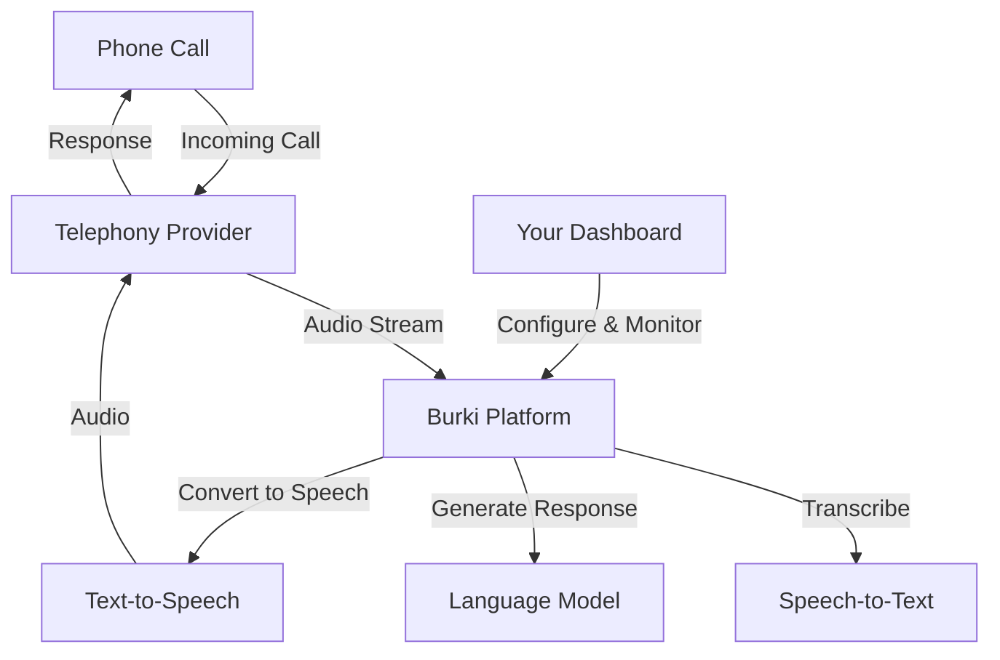

Burki Voice AI integrates seamlessly with leading telephony, speech, and AI providers. All integrations are managed through the Burki Dashboard or API.

## How It Works

<Callout type="info">
You can mix and match providers for STT, LLM, and TTS. Configure per-assistant or at the organization level.
</Callout>

---

## Provider Categories

<AccordionGroup>
  <Accordion icon="phone" title="Telephony Providers">
    Burki supports multiple telephony providers for handling phone calls and SMS:
    
    | Provider | Features |
    |----------|----------|
    | **Twilio** | Voice calls, SMS/MMS, global coverage |
    | **Telnyx** | Voice calls, SMS, competitive pricing |
    | **Vonage** | Voice calls, SMS, international coverage |
    
    **Configuration:**
    - Go to **Settings** → **Provider Keys** → **Telephony**
    - Enter your provider credentials (API keys, account IDs)
    - Burki automatically configures webhooks for you
    
    Each assistant can use different telephony providers. Configure in the assistant settings or let Burki use your organization defaults.
    
    [Learn more about Telephony Providers →](/telephony-providers)
  </Accordion>

  <Accordion icon="waveform" title="Speech-to-Text (STT) Providers">
    Convert caller speech to text in real-time:
    
    | Provider | Best For |
    |----------|----------|
    | **Deepgram** | Fast, accurate, phone-optimized |
    | **Azure Speech** | Enterprise, 100+ languages |
    
    **Configuration:**
    - **Burki Cloud:** Select provider in assistant settings (no API key needed)
    - **BYO Mode:** Add your API key in **Settings** → **Provider Keys** → **STT**
    
    [Learn more about STT Providers →](/stt-providers)
  </Accordion>

  <Accordion icon="robot" title="Language Model (LLM) Providers">
    Power your assistant's intelligence with leading LLMs:
    
    | Provider | Models |
    |----------|--------|
    | **OpenAI** | GPT-4o, GPT-4o-mini, GPT-4 Turbo |
    | **Anthropic** | Claude 3.5 Sonnet, Claude 3 Opus |
    | **Google** | Gemini 1.5 Pro, Gemini 1.5 Flash |
    | **Groq** | Llama 3, Mixtral (ultra-fast) |
    | **xAI** | Grok |
    
    **Configuration:**
    - **Burki Cloud:** Select provider and model in assistant settings
    - **BYO Mode:** Add your API key in **Settings** → **Provider Keys** → **LLM**
    
    [Learn more about LLM Providers →](/llm-providers)
  </Accordion>

  <Accordion icon="volume-high" title="Text-to-Speech (TTS) Providers">
    Give your assistant a natural-sounding voice:
    
    | Provider | Best For |
    |----------|----------|
    | **ElevenLabs** | Most natural voices, voice cloning |
    | **Cartesia** | Low latency, 40+ languages |
    | **Deepgram** | Fast, cost-effective |
    | **Azure Speech** | Enterprise, 100+ languages |
    | **Resemble** | Custom voice cloning |
    
    **Configuration:**
    - **Burki Cloud:** Select provider and voice in assistant settings
    - **BYO Mode:** Add your API key in **Settings** → **Provider Keys** → **TTS**
    
    [Learn more about TTS Providers →](/tts-providers)
  </Accordion>
</AccordionGroup>

---

## Configuration Modes

<CardGroup cols={2}>
  <Card title="Burki Cloud" icon="cloud">
    **Easiest setup**
    
    - No API keys needed
    - We manage all provider connections
    - Select providers in assistant settings
    - Pay-as-you-go pricing
  </Card>
  <Card title="BYO (Bring Your Own)" icon="key">
    **Use your own accounts**
    
    - Add your API keys in Settings
    - Pay providers directly
    - Leverage enterprise pricing
    - Full control over costs
  </Card>
</CardGroup>

<Tip>
You can mix modes! Use Burki Cloud for some providers and BYO for others based on your needs.
</Tip>

---

## Setting Up Integrations

<Steps>
  <Step title="Choose Your Mode">
    Decide whether to use Burki Cloud (managed) or BYO (your own API keys) for each provider category.
  </Step>
  
  <Step title="Add API Keys (BYO Only)">
    If using BYO mode, go to **Settings** → **Provider Keys** and add your credentials for each provider.
  </Step>
  
  <Step title="Configure Assistants">
    When creating or editing an assistant, select your preferred providers for LLM, TTS, and STT.
  </Step>
  
  <Step title="Assign Phone Numbers">
    Purchase or sync phone numbers and assign them to your assistants.
  </Step>
</Steps>

---

## Next Steps

<CardGroup cols={2}>
  <Card title="Telephony Providers" icon="phone" href="/telephony-providers">
    Configure Twilio, Telnyx, or Vonage
  </Card>
  <Card title="AI Configuration" icon="brain" href="/ai-configuration">
    Set up LLM, TTS, and STT providers
  </Card>
  <Card title="BYO API Keys" icon="key" href="/byo-api-keys">
    Use your own provider accounts
  </Card>
  <Card title="FAQ" icon="circle-question" href="/faq">
    Common questions and troubleshooting
  </Card>
</CardGroup>
