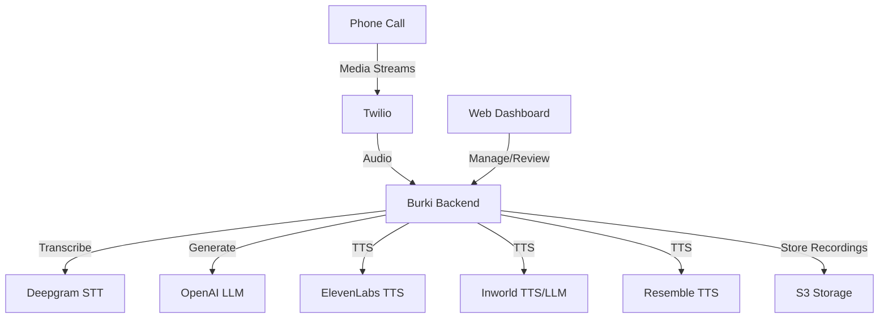

# Integrations

Burki Voice AI integrates seamlessly with leading telephony, speech, and AI providers. This page explains what each integration does and how to configure it.

## Integration Flow

<Callout type="info">
You can mix and match providers for STT, LLM, and TTS. Configure per-assistant or globally.
</Callout>

<AccordionGroup>
  <Accordion icon="phone" title="Twilio (Telephony)">
    **Purpose:** Handles phone calls, media streaming, and SMS.
    
    **Setup:**
    - Sign up at [Twilio](https://www.twilio.com/).
    - Buy a phone number and enable Media Streams.
    - Set environment variables:
      - `TWILIO_ACCOUNT_SID`
      - `TWILIO_AUTH_TOKEN`
    - Configure Twilio webhook to point to your Burki backend.
  </Accordion>

  <Accordion icon="waveform" title="Speech-to-Text (STT) Providers">
    **Deepgram** (default, recommended)
    - Real-time transcription of audio calls.
    - Set `DEEPGRAM_API_KEY` in your `.env`.
    
    **Other STT Providers** (coming soon or custom)
    - You can extend Burki to use other STT APIs by customizing the backend.
  </Accordion>

  <Accordion icon="robot" title="Language Model (LLM) Providers">
    **OpenAI** (default, recommended)
    - Generates intelligent responses using GPT models.
    - Set `OPENAI_API_KEY` in your `.env`.
    
    **Inworld** (optional)
    - Use `INWORLD_BEARER_TOKEN` for Inworld LLM.
    
    **Custom LLMs**
    - Configure provider and API key in assistant settings or `.env`.
  </Accordion>

  <Accordion icon="volume-high" title="Text-to-Speech (TTS) Providers">
    **ElevenLabs** (default, recommended)
    - Converts text responses to natural-sounding speech.
    - Set `ELEVENLABS_API_KEY` in your `.env`.
    
    **Deepgram TTS** (optional)
    - Use Deepgram for TTS if enabled in your assistant config.
    
    **Inworld** (optional)
    - Use Inworld for TTS with `INWORLD_BEARER_TOKEN`.
    
    **Resemble** (optional)
    - Use `RESEMBLE_API_KEY` for Resemble TTS.
  </Accordion>

  <Accordion icon="cloud" title="Storage (S3, etc.)">
    - Stores call recordings and large audio files.
    - Set S3 environment variables if using cloud storage.
  </Accordion>

  <Accordion icon="database" title="Database (PostgreSQL)">
    - Stores all app data (users, calls, assistants, etc.)
    - Set `DATABASE_URL` in your `.env` file.
  </Accordion>
</AccordionGroup>

<Callout type="success">
For a full list of required and optional environment variables, see the [Configuration](configuration) page.
</Callout>

For troubleshooting integration issues, see the [FAQ](faq) or open an issue on GitHub. 