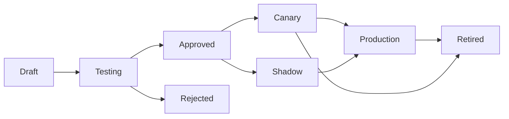

<Callout type="info">
The Learning & Memory System enables your AI assistants to remember information across calls, personalize conversations, and continuously improve through evaluation and prompt optimization.
</Callout>

---

## Overview

Burki's Learning & Memory System provides:

<CardGroup cols={2}>
  <Card title="Persistent Memory" icon="brain">
    Store and recall facts about callers, preferences, and past interactions across multiple calls.
  </Card>
  
  <Card title="Prompt Versioning" icon="code-branch">
    Manage system prompts with version control, A/B testing, and gradual rollouts.
  </Card>
  
  <Card title="Evaluation System" icon="flask-vial">
    Test prompt changes against datasets before deploying to production.
  </Card>
  
  <Card title="Privacy-First Design" icon="shield-halved">
    GDPR-compliant with caller opt-out, PII redaction, and soft deletion.
  </Card>
</CardGroup>

---

## Memory Types

Memories are categorized by what kind of information they represent:

| Type | Description | Example |
|------|-------------|---------|
| **Semantic** | General facts and knowledge | "Customer prefers email contact" |
| **Episodic** | Specific events and interactions | "Discussed order #123 on Jan 5" |
| **Procedural** | How-to knowledge and processes | "To escalate, transfer to ext 1234" |

<Callout type="tip">
Semantic memories are best for persistent preferences. Episodic memories capture conversation history. Procedural memories help the AI follow specific workflows.
</Callout>

---

## Memory Scopes

Control where memories apply with scoping:

| Scope | Applies To | Use Case |
|-------|-----------|----------|
| **Organization** | All calls in your organization | Company policies, business hours |
| **Assistant** | One specific assistant | Assistant-specific knowledge |
| **Location** | Store or branch | Location-specific info (hours, address) |
| **Caller** | Individual customer | Personal preferences, history |

### Scope Hierarchy

When retrieving memories, the system searches from most specific to most general:

```
Caller → Location → Assistant → Organization
```

This allows organization-wide defaults to be overridden at more specific levels.

---

## Memory Features

<Accordion title="Privacy-Safe Identifiers">
Caller phone numbers are hashed before storage using SHA-256. The original phone number is never stored with memories, protecting caller privacy while still enabling personalization.

```
+1234567890 → a3f2b8c9d4e5f6...
```
</Accordion>

<Accordion title="Confidence Scoring">
Each memory has a confidence score from 0 to 1:

| Score | Meaning |
|-------|---------|
| 0.9 - 1.0 | High confidence (explicit statement) |
| 0.7 - 0.9 | Medium confidence (inferred) |
| 0.5 - 0.7 | Low confidence (uncertain) |
| < 0.5 | Very low (speculation) |

Lower confidence memories may be excluded from context or presented with caveats.
</Accordion>

<Accordion title="Time-to-Live (TTL)">
Set automatic expiration for memories:

- **Short-term**: 24 hours (temporary preferences)
- **Medium-term**: 30 days (campaign-related)
- **Long-term**: 1 year (customer preferences)
- **Permanent**: Never expires (critical facts)

Expired memories are automatically soft-deleted.
</Accordion>

<Accordion title="Vector Embeddings">
Memories are embedded as vectors for semantic search. When the AI needs context, it searches for memories semantically related to the current conversation, not just keyword matches.
</Accordion>

---

## Memory Graph

Memories are connected in a graph structure with relationship types:

| Relationship | Description | Example |
|--------------|-------------|---------|
| **Temporal** | Happened before/after | "Order placed" → "Order shipped" |
| **Causal** | Caused by | "Complaint filed" → "Refund issued" |
| **Resolution** | Resolved by | "Issue reported" → "Issue resolved" |
| **Semantic** | Related to | "Prefers email" ↔ "Contact preferences" |
| **Conflict** | Contradicts | "Wants refund" vs "Satisfied with resolution" |
| **Supersedes** | Replaces | "New address" supersedes "Old address" |

The graph enables context expansion—when retrieving memories, related memories are included for fuller context.

---

## Caller Privacy

<Accordion title="Opt-Out Support">
Callers can opt out of memory storage:

1. **Verbal request**: If a caller says "don't remember this" or similar, the AI should respect the request
2. **API opt-out**: Mark a caller as opted-out via API
3. **Dashboard**: Manage opted-out callers in the Learning dashboard

Opted-out callers:
- No new memories are created
- Existing memories are soft-deleted
- Only session-level context is maintained (within single call)
</Accordion>

<Accordion title="GDPR Compliance">
The memory system supports GDPR data subject rights:

| Right | Implementation |
|-------|----------------|
| **Access** | Export all memories for a caller |
| **Rectification** | Edit or correct memories |
| **Erasure** | Soft-delete all caller memories |
| **Portability** | Export in standard JSON format |

Use the Caller Privacy Manager in the dashboard or API to handle these requests.
</Accordion>

<Accordion title="Memory Write Policies">
Configure which types of facts assistants can store:

```json
{
  "memory_write_policy": {
    "allowed_types": ["preferences", "contact_info", "order_history"],
    "blocked_types": ["health_info", "financial_details"],
    "require_explicit_consent": true
  }
}
```
</Accordion>

---

## PII Redaction

Personally identifiable information is automatically detected and redacted before storage.

### Detected PII Types

| Type | Pattern | Replacement |
|------|---------|-------------|
| Phone numbers | US and international | `[PHONE]` |
| Email addresses | Standard email format | `[EMAIL]` |
| SSN | 9-digit US format | `[SSN]` |
| Credit cards | Visa, MC, Amex, Discover | `[CREDIT_CARD]` |
| Addresses | Street addresses | `[ADDRESS]` |
| Dates of birth | Date patterns with DOB context | `[DOB]` |
| IP addresses | IPv4 and IPv6 | `[IP_ADDRESS]` |

<Callout type="note">
PII redaction is conservative—it over-redacts rather than risk missing sensitive data. Configure which patterns to detect based on your compliance requirements.
</Callout>

---

## Prompt Versioning

Manage system prompts with full version control and safe rollout capabilities.

### Lifecycle Stages



| Stage | Description |
|-------|-------------|
| **Draft** | Being edited, not in use |
| **Testing** | Running through evaluation harness |
| **Approved** | Human approval obtained |
| **Canary** | Serving 5-10% of traffic |
| **Shadow** | Parallel execution (logged but no impact) |
| **Production** | Serving 100% of traffic |
| **Retired** | No longer in use |
| **Rejected** | Failed evaluation |

### Creating a New Version

<Tabs>
  <Tab title="Dashboard">
    1. Go to **Learning** > **Prompt Versions** for your assistant
    2. Click **New Version**
    3. Edit the system prompt
    4. Add version notes explaining changes
    5. Save as Draft
    6. Run evaluation to move to Testing
  </Tab>
  <Tab title="API">
    ```bash
    curl -X POST "https://api.burki.dev/api/learning/assistants/{assistant_id}/prompts" \
      -H "Authorization: Bearer YOUR_API_KEY" \
      -H "Content-Type: application/json" \
      -d '{
        "system_prompt": "You are a helpful assistant...",
        "version_name": "Improved greeting v2",
        "generation_notes": "Added friendlier opening"
      }'
    ```
  </Tab>
</Tabs>

### Canary Rollouts

Gradually roll out prompt changes to reduce risk:

1. **Start Canary**: Deploy to 5% of traffic
2. **Monitor Metrics**: Watch success rate, call duration, customer satisfaction
3. **Increase Traffic**: Gradually increase to 25%, 50%, 75%
4. **Promote or Rollback**: Move to production or revert if issues arise

<Callout type="warning">
Always run evaluations before starting a canary. Never promote directly from draft to production.
</Callout>

---

## Evaluation System

Test prompt changes against curated datasets before deployment.

### Evaluation Datasets

Create datasets of test cases representing expected conversations:

```json
{
  "name": "Customer Support Golden Set",
  "dataset_type": "golden",
  "cases": [
    {
      "case_name": "Refund Request",
      "conversation": [
        {"role": "user", "content": "I want a refund for order #123"},
        {"role": "assistant", "content": "I'd be happy to help..."}
      ],
      "expected_response": {
        "should_contain": ["refund", "process"],
        "intent": "refund_request",
        "should_call_tool": "check_order_status"
      }
    }
  ]
}
```

### Dataset Types

| Type | Purpose |
|------|---------|
| **Golden** | Curated high-quality examples for comprehensive testing |
| **Regression** | Cases that previously failed (prevent regressions) |
| **Synthetic** | AI-generated cases for broader coverage |

### Running Evaluations

```bash
curl -X POST "https://api.burki.dev/api/learning/assistants/{assistant_id}/eval/run" \
  -H "Authorization: Bearer YOUR_API_KEY" \
  -H "Content-Type: application/json" \
  -d '{
    "prompt_version_id": 42,
    "dataset_id": 1,
    "pass_threshold": 0.8
  }'
```

### Evaluation Metrics

| Metric | Description |
|--------|-------------|
| **Keyword Matching** | Required words present in response |
| **Intent Accuracy** | Correct intent detected |
| **Tool Call Accuracy** | Correct tools called with correct parameters |
| **Fluency Score** | Response quality and naturalness |

---

## Dashboard UI

The Learning Dashboard provides visual management of all features:

<Accordion title="Memory Browser">
- Search and filter stored memories
- Filter by type (semantic, episodic, procedural)
- Filter by scope (organization, assistant, caller)
- View confidence scores and TTL
- Edit or delete individual memories
</Accordion>

<Accordion title="Prompt Timeline">
- Visual timeline of all prompt versions
- Compare versions side-by-side
- See evaluation results for each version
- One-click promote/demote/rollback
- View rollout percentages
</Accordion>

<Accordion title="Eval Dataset Manager">
- Create and manage test datasets
- Add cases from real call transcripts
- Run evaluations on demand
- View detailed results and scores
- Export datasets for sharing
</Accordion>

<Accordion title="Caller Privacy Manager">
- View opted-out callers
- Add manual opt-outs
- Export caller data (GDPR access requests)
- Delete caller data (GDPR erasure requests)
</Accordion>

---

## API Reference

### Memory Endpoints

| Method | Endpoint | Description |
|--------|----------|-------------|
| `GET` | `/api/learning/memories` | List memories with filters |
| `GET` | `/api/learning/memories/{id}` | Get a specific memory |
| `POST` | `/api/learning/memories` | Create a memory manually |
| `PUT` | `/api/learning/memories/{id}` | Update a memory |
| `DELETE` | `/api/learning/memories/{id}` | Soft-delete a memory |
| `POST` | `/api/learning/memories/search` | Semantic search |

### Prompt Version Endpoints

| Method | Endpoint | Description |
|--------|----------|-------------|
| `GET` | `/api/learning/assistants/{id}/prompts` | List prompt versions |
| `POST` | `/api/learning/assistants/{id}/prompts` | Create new version |
| `POST` | `/api/learning/assistants/{id}/prompts/{id}/approve` | Approve version |
| `POST` | `/api/learning/assistants/{id}/prompts/{id}/start-canary` | Start canary rollout |
| `POST` | `/api/learning/assistants/{id}/prompts/{id}/promote` | Promote to production |
| `POST` | `/api/learning/assistants/{id}/prompts/{id}/rollback` | Rollback version |

### Eval Endpoints

| Method | Endpoint | Description |
|--------|----------|-------------|
| `GET` | `/api/learning/assistants/{id}/eval-datasets` | List datasets |
| `POST` | `/api/learning/assistants/{id}/eval-datasets` | Create dataset |
| `POST` | `/api/learning/assistants/{id}/eval-datasets/{id}/cases` | Add test case |
| `POST` | `/api/learning/assistants/{id}/eval/run` | Run evaluation |

---

## Best Practices

- **Start with organization memories**: Add common facts (business hours, policies) at the org level
- **Use appropriate TTL**: Don't store temporary information permanently
- **Test before deploying**: Always run evaluations before canary rollouts
- **Monitor canary metrics**: Watch for degradation in success rates or call duration
- **Review memories regularly**: Audit stored memories for accuracy and relevance
- **Respect privacy**: Honor opt-out requests promptly and completely

<Callout type="success">
The Learning & Memory System is most powerful when combined: store memories about what works, evaluate prompt changes against real scenarios, and gradually roll out improvements with confidence.
</Callout>
