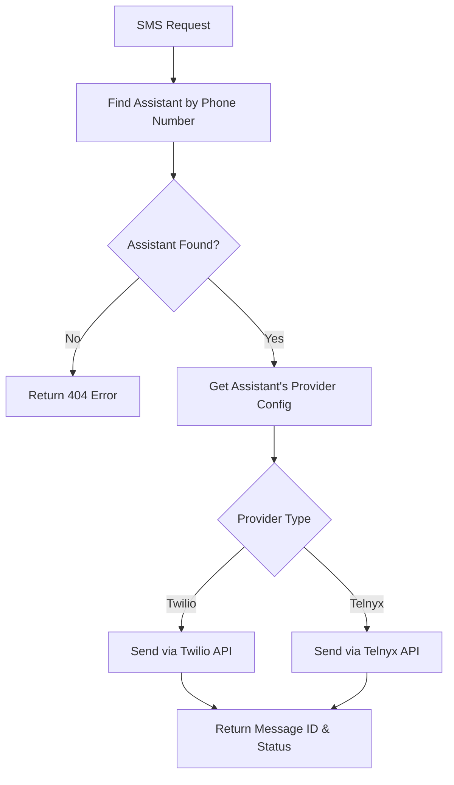

<Card title="SMS Messaging" icon="message">
  Send text messages and multimedia content through your AI assistants using Twilio or Telnyx
</Card>

## Overview

The messaging system allows your AI assistants to send SMS and MMS messages to customers and users. The platform supports both Twilio and Telnyx as telephony providers, automatically selecting the appropriate provider based on your assistant configuration.

## Key Features

<CardGroup cols={2}>
  <Card title="Multi-Provider Support" icon="network-wired">
    Seamlessly switch between Twilio and Telnyx providers per assistant
  </Card>
  <Card title="MMS Support" icon="image">
    Send images, documents, and other media files alongside text messages
  </Card>
  <Card title="Assistant-Based Routing" icon="robot">
    Messages are automatically routed through the correct provider based on the sending assistant
  </Card>
  <Card title="E.164 Validation" icon="check-circle">
    Automatic phone number format validation ensures reliable delivery
  </Card>
</CardGroup>

## How It Works

The messaging system follows a simple but powerful flow:



1. **Assistant Lookup**: The system identifies which assistant owns the `from_phone_number`
2. **Provider Selection**: Automatically determines whether to use Twilio or Telnyx based on the assistant's configuration
3. **Message Delivery**: Sends the message through the appropriate provider's API
4. **Response**: Returns confirmation with message ID and provider information

## Provider Configuration

### Per-Assistant Providers

Each assistant can be configured with different telephony providers:

```json
{
  "assistant_id": 123,
  "name": "Customer Service Bot",
  "telnyx_config": {
    "api_key": "KEY_xxxx",
    "connection_id": "xxxx-xxxx-xxxx"
  },
  "twilio_config": {
    "account_sid": "ACxxxx",
    "auth_token": "xxxx"
  }
}
```

### Provider Priority

When an assistant has both Telnyx and Twilio configured:
1. **Telnyx** is used by default (typically lower cost)
2. **Twilio** is used as fallback if Telnyx is unavailable
3. You can override this behavior per assistant

## Supported Message Types

### SMS (Text Messages)

Send plain text messages up to 1600 characters:

```json
{
  "from_phone_number": "+1234567890",
  "to_phone_number": "+1555123456",
  "message": "Your appointment is confirmed for tomorrow at 2 PM."
}
```

### MMS (Multimedia Messages)

Send images, documents, and other media files:

```json
{
  "from_phone_number": "+1234567890",
  "to_phone_number": "+1555123456",
  "message": "Here are your test results:",
  "media_urls": [
    "https://yourdomain.com/results.pdf",
    "https://yourdomain.com/chart.png"
  ]
}
```

## Use Cases

### Customer Service

<AccordionGroup>
  <Accordion title="Follow-up Messages">
    Send follow-up messages after customer service calls with links to resources, ticket numbers, or additional information.
  </Accordion>
  
  <Accordion title="Appointment Reminders">
    Automated appointment reminders with confirmation options and rescheduling links.
  </Accordion>
  
  <Accordion title="Order Updates">
    Shipping notifications, delivery confirmations, and order status updates.
  </Accordion>
  
  <Accordion title="Support Documentation">
    Share troubleshooting guides, user manuals, and how-to videos via MMS.
  </Accordion>
</AccordionGroup>

### Sales & Marketing

<AccordionGroup>
  <Accordion title="Lead Follow-up">
    Personalized follow-up messages after sales calls with proposals and pricing information.
  </Accordion>
  
  <Accordion title="Event Invitations">
    Send event invitations, webinar links, and calendar attachments.
  </Accordion>
  
  <Accordion title="Product Updates">
    Share product announcements, feature updates, and release notes.
  </Accordion>
  
  <Accordion title="Promotional Content">
    Special offers, discount codes, and promotional materials (with proper consent).
  </Accordion>
</AccordionGroup>

### Healthcare

<AccordionGroup>
  <Accordion title="Appointment Confirmations">
    HIPAA-compliant appointment confirmations and pre-visit instructions.
  </Accordion>
  
  <Accordion title="Medication Reminders">
    Automated medication reminders and refill notifications.
  </Accordion>
  
  <Accordion title="Test Results">
    Secure delivery of test results and lab reports via encrypted links.
  </Accordion>
  
  <Accordion title="Health Tips">
    Personalized health tips and wellness recommendations.
  </Accordion>
</AccordionGroup>

## Integration Patterns

### Post-Call Follow-up

Automatically send follow-up messages after calls end:

```python
# After a call ends, send follow-up SMS
async def handle_call_end(call_sid, assistant_id, customer_phone):
    # Get call summary or transcript
    summary = await get_call_summary(call_sid)
    
    # Send follow-up SMS
    response = await send_sms({
        "from_phone_number": assistant.phone_number,
        "to_phone_number": customer_phone,
        "message": f"Thanks for calling! Summary: {summary}. Questions? Reply to this message."
    })
```

### Scheduled Messaging

Set up scheduled messaging workflows:

```python
# Schedule appointment reminder
import schedule
import time

def send_appointment_reminder():
    appointments = get_upcoming_appointments()
    
    for appointment in appointments:
        send_sms({
            "from_phone_number": appointment.assistant_phone,
            "to_phone_number": appointment.customer_phone,
            "message": f"Reminder: Your appointment is tomorrow at {appointment.time}"
        })

# Run every day at 6 PM
schedule.every().day.at("18:00").do(send_appointment_reminder)
```

### Interactive Workflows

Create two-way messaging workflows:

```python
# Handle incoming SMS responses
@app.post("/sms/webhook")
async def handle_incoming_sms(request):
    sms_data = await request.json()
    message = sms_data['message'].lower()
    from_phone = sms_data['from']
    
    if 'confirm' in message:
        await send_sms({
            "from_phone_number": ASSISTANT_PHONE,
            "to_phone_number": from_phone,
            "message": "Your appointment is confirmed! See you tomorrow."
        })
    elif 'reschedule' in message:
        await send_sms({
            "from_phone_number": ASSISTANT_PHONE,
            "to_phone_number": from_phone,
            "message": "Please call us at (555) 123-4567 to reschedule."
        })
```

## Best Practices

### Compliance & Regulations

<Warning>
**Regulatory Compliance**: Always ensure compliance with local regulations like TCPA (US), GDPR (EU), and CASL (Canada) when sending SMS messages.
</Warning>

- **Opt-in Required**: Only send messages to users who have explicitly opted in
- **Opt-out Mechanism**: Always provide a way for users to unsubscribe (e.g., "Reply STOP to opt out")
- **Business Hours**: Respect time zones and send messages during appropriate hours
- **Content Guidelines**: Follow carrier guidelines for message content and frequency

### Message Optimization

- **Keep It Concise**: SMS works best with short, clear messages
- **Include CTAs**: Provide clear next steps or calls to action
- **Personalization**: Use customer names and relevant context
- **Timing**: Send messages at appropriate times based on user preferences

### Error Handling

Always implement proper error handling:

```python
try:
    response = await send_sms(message_data)
    logger.info(f"SMS sent successfully: {response['message_id']}")
except HTTPException as e:
    if e.status_code == 404:
        logger.error("Assistant not found for phone number")
    elif e.status_code == 400:
        logger.error("Invalid phone number format")
    else:
        logger.error(f"SMS failed: {e.detail}")
```

### Rate Limiting

Be mindful of rate limits:
- **Twilio**: Up to 1 message per second by default (varies by account)
- **Telnyx**: Varies by account configuration
- **Best Practice**: Implement queuing for high-volume scenarios

## Getting Started

<Steps>
  <Step title="Configure Your Assistant">
    Set up your assistant with Twilio or Telnyx credentials in the dashboard.
  </Step>
  
  <Step title="Assign Phone Numbers">
    Assign phone numbers to your assistants that will be used as sender numbers.
  </Step>
  
  <Step title="Send Your First SMS">
    Use the `/sms/send` endpoint to send your first message.
    
    ```bash
    curl -X POST "https://api.burki.dev/sms/send" \
      -H "Authorization: Bearer YOUR_API_KEY" \
      -H "Content-Type: application/json" \
      -d '{
        "from_phone_number": "+1234567890",
        "to_phone_number": "+1555123456",
        "message": "Hello from your AI assistant!"
      }'
    ```
  </Step>
  
  <Step title="Handle Responses">
    Implement proper error handling and response processing in your application.
  </Step>
</Steps>

## Next Steps

<CardGroup cols={2}>
  <Card title="API Reference" icon="code" href="/api-reference/messaging/send-sms">
    Detailed API documentation for the SMS endpoint
  </Card>
  <Card title="Telephony Providers" icon="phone" href="/telephony-providers">
    Learn about configuring Twilio and Telnyx providers
  </Card>
  <Card title="Webhooks" icon="webhook" href="/api-reference/webhooks">
    Set up webhooks to handle incoming SMS responses
  </Card>
  <Card title="Phone Numbers" icon="phone-volume" href="/api-reference/organization/list-phonenumbers">
    Manage phone numbers for your assistants
  </Card>
</CardGroup>

