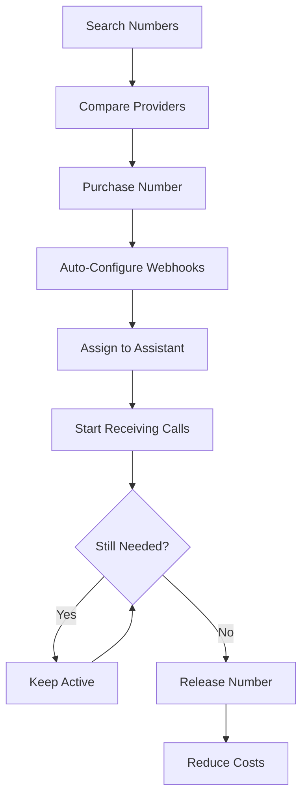

# Phone Number Management

Burki provides comprehensive phone number management capabilities, allowing you to search, purchase, configure, and release phone numbers from both Twilio and Telnyx directly through the platform. This eliminates the need to manage numbers separately in each provider's console.

## Overview

With Burki's phone number management system, you can:

- **Search** for available numbers across multiple providers
- **Purchase** numbers instantly with automatic configuration
- **Manage** your entire phone number inventory in one place
- **Compare** costs between Twilio and Telnyx
- **Release** unused numbers to optimize costs

<Info>
**Unified Management**: Instead of juggling multiple provider dashboards, manage all your phone numbers from both Twilio and Telnyx in a single interface.
</Info>

## How It Works



## Core Features

### Multi-Provider Search

Search for available phone numbers from both Twilio and Telnyx with a single API call:

```json
{
  "area_code": "415",
  "locality": "San Francisco", 
  "provider": "telnyx",
  "limit": 10
}
```

**Search Filters**:
- Area code and region
- City/locality
- Number patterns
- Country codes
- Capabilities (voice, SMS, MMS)

### Instant Purchase & Configuration

Purchase numbers with automatic setup:

```json
{
  "phone_number": "+14155551234",
  "provider": "telnyx",
  "assistant_id": 123,
  "friendly_name": "SF Support Line"
}
```

**Automatic Configuration**:
- ✅ Webhook URLs configured
- ✅ Voice capabilities enabled
- ✅ SMS/MMS capabilities enabled
- ✅ Database record created
- ✅ Assistant assignment (optional)

### Inventory Management

Track and manage all your phone numbers in one place:

- **Usage Analytics**: Call and message volume per number
- **Cost Tracking**: Monthly costs across all providers
- **Assignment Management**: Which assistant owns each number
- **Provider Distribution**: Numbers across Twilio and Telnyx
- **Geographic Coverage**: Numbers by country and region

### Cost Optimization

Optimize your phone number costs:

- **Provider Comparison**: Compare Twilio vs Telnyx pricing
- **Usage-Based Decisions**: Release low-usage numbers
- **Bulk Operations**: Purchase or release multiple numbers
- **Regular Audits**: Automated cost analysis and recommendations

## API Endpoints

| Endpoint | Method | Description |
|----------|---------|-------------|
| `/phone-numbers/search` | POST | Search available numbers |
| `/phone-numbers/purchase` | POST | Purchase a phone number |
| `/phone-numbers/release` | POST | Release a phone number |
| `/phone-numbers/countries` | GET | List supported countries |

## Getting Started

### 1. Search for Numbers

Find available numbers in your target area:

```bash
curl -X POST "https://api.burki.dev/phone-numbers/search" \
  -H "Authorization: Bearer YOUR_API_KEY" \
  -H "Content-Type: application/json" \
  -d '{
    "area_code": "415",
    "provider": "telnyx",
    "limit": 10
  }'
```

### 2. Purchase a Number

Buy a number from the search results:

```bash
curl -X POST "https://api.burki.dev/phone-numbers/purchase" \
  -H "Authorization: Bearer YOUR_API_KEY" \
  -H "Content-Type: application/json" \
  -d '{
    "phone_number": "+14155551234",
    "provider": "telnyx",
    "assistant_id": 123
  }'
```

### 3. Start Using the Number

The number is immediately ready to:
- ✅ Receive incoming calls
- ✅ Send and receive SMS/MMS
- ✅ Be assigned to your AI assistant
- ✅ Handle voice interactions

## Provider Comparison

### Twilio vs Telnyx

| Feature | Twilio | Telnyx |
|---------|--------|--------|
| **Global Coverage** | 100+ countries | 60+ countries |
| **Pricing** | Higher cost, premium service | Competitive pricing |
| **API Maturity** | Very mature, extensive docs | Modern, developer-friendly |
| **Features** | Full feature set | Core features, growing |
| **Reliability** | Enterprise-grade | High reliability |
| **Support** | Comprehensive | Developer-focused |

### When to Choose Which Provider

**Choose Twilio when**:
- You need maximum global coverage
- You require advanced features (fax, SIP, etc.)
- You have complex compliance requirements
- Budget is less of a concern

**Choose Telnyx when**:
- Cost optimization is important
- You prefer modern API design
- You need good US/Europe coverage
- You want competitive international rates

## Use Cases

### Customer Support Scaling

**Scenario**: Growing support team needs local numbers in multiple regions

```javascript
// Purchase numbers for different regions
const regions = [
  { area_code: "415", assistant_id: 101, name: "West Coast Support" },
  { area_code: "212", assistant_id: 102, name: "East Coast Support" },
  { area_code: "312", assistant_id: 103, name: "Central Support" }
];

for (const region of regions) {
  await purchaseNumber({
    area_code: region.area_code,
    provider: "telnyx",
    assistant_id: region.assistant_id,
    friendly_name: region.name
  });
}
```

### Multi-Brand Management

**Scenario**: Multiple brands need separate phone numbers

```javascript
// Different providers for different brands
await purchaseNumber({
  phone_number: "+18005551234",
  provider: "twilio",      // Premium brand uses Twilio
  assistant_id: 201,
  friendly_name: "Premium Brand Support"
});

await purchaseNumber({
  phone_number: "+18665554321", 
  provider: "telnyx",      // Budget brand uses Telnyx
  assistant_id: 202,
  friendly_name: "Budget Brand Support"
});
```

### Geographic Expansion

**Scenario**: Expanding to new international markets

```javascript
// Search for numbers in new countries
const countries = ["GB", "AU", "DE", "CA"];

for (const country of countries) {
  const numbers = await searchNumbers({
    country_code: country,
    provider: "twilio",  // Use Twilio for international
    limit: 5
  });
  
  if (numbers.length > 0) {
    await purchaseNumber({
      phone_number: numbers[0].phone_number,
      provider: "twilio",
      assistant_id: getRegionalAssistant(country)
    });
  }
}
```

### Cost Optimization Audit

**Scenario**: Regular cleanup of unused numbers

```javascript
// Monthly cleanup of unused numbers
async function monthlyAudit() {
  const numbers = await getOrganizationNumbers();
  
  for (const number of numbers) {
    const usage = await getNumberUsage(number.phone_number, 30); // Last 30 days
    
    if (usage.total_calls === 0 && usage.total_sms === 0) {
      console.log(`Releasing unused number: ${number.phone_number}`);
      await releaseNumber({ phone_number: number.phone_number });
    }
  }
}
```

## Best Practices

### Search Strategy

1. **Start Broad**: Begin with area code only
2. **Refine Gradually**: Add filters incrementally
3. **Compare Providers**: Search both Twilio and Telnyx
4. **Check Capabilities**: Ensure numbers support required features

### Purchase Planning

1. **Verify Requirements**: Confirm number capabilities match needs
2. **Assistant Readiness**: Ensure target assistant is configured
3. **Budget Approval**: Consider monthly costs and setup fees
4. **Geographic Strategy**: Plan number distribution across regions

### Cost Management

1. **Regular Audits**: Monthly review of number usage
2. **Usage Tracking**: Monitor calls and messages per number
3. **Provider Optimization**: Evaluate cost per provider
4. **Automated Cleanup**: Script to release unused numbers

### Security & Compliance

1. **Access Control**: Limit who can purchase/release numbers
2. **Audit Logging**: Track all number management activities
3. **Compliance Check**: Verify regulatory requirements by country
4. **Backup Strategy**: Document number assignments and purposes

## Troubleshooting

### Common Issues

| Issue | Cause | Solution |
|-------|-------|----------|
| "Number not available" | Number taken by another user | Search for alternatives |
| "Insufficient balance" | Low provider account balance | Add funds to provider account |
| "Invalid credentials" | Wrong API keys | Check provider credentials |
| "Country not supported" | Provider limitation | Try alternative provider |

### Provider-Specific Issues

**Twilio**:
- Geographic restrictions for certain countries
- Account verification requirements
- Compliance documentation needs

**Telnyx**:
- Connection ID configuration
- Account activation requirements
- Regional availability limitations

### Monitoring & Alerts

Set up monitoring for:
- Failed purchase attempts
- Number usage patterns
- Cost threshold alerts
- Provider availability issues

<Warning>
**Billing Impact**: Phone number purchases result in immediate charges to your provider accounts. Always verify pricing and account balances before making purchases.
</Warning>

## Next Steps

1. **[Search Numbers](api-reference/phone-numbers/search)**: Learn how to search for available numbers
2. **[Purchase Numbers](api-reference/phone-numbers/purchase)**: Buy numbers with automatic configuration
3. **[Release Numbers](api-reference/phone-numbers/release)**: Clean up unused numbers
4. **[Country Codes](api-reference/phone-numbers/countries)**: Check global availability

The phone number management system gives you complete control over your telephony infrastructure while maintaining the flexibility to optimize costs and coverage across multiple providers.

