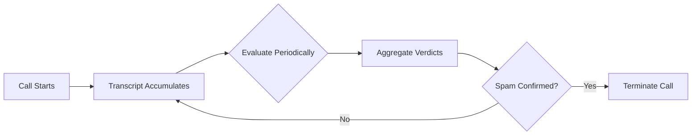

<Callout type="info">
Burki's AI-powered Spam Detection System evaluates calls in real-time to identify and automatically terminate spam, scam, and unwanted calls—protecting your business and saving agent time.
</Callout>

---

## Overview

The Spam Detection System uses LLM-based evaluation to analyze conversations and detect unwanted calls:

<CardGroup cols={3}>
  <Card title="Real-Time Analysis" icon="clock">
    Evaluates transcripts during live calls without blocking conversation flow.
  </Card>
  
  <Card title="Configurable Scenarios" icon="sliders">
    Define what constitutes spam for your specific business context.
  </Card>
  
  <Card title="Fail-Open Design" icon="shield">
    Errors default to allowing calls—never blocks legitimate callers.
  </Card>
</CardGroup>

---

## How It Works



<Steps>
  <Step title="Call Begins">
    Spam detection is registered when the call starts. A grace period prevents premature evaluations.
  </Step>
  <Step title="Transcript Evaluation">
    As conversation progresses, the LLM periodically evaluates the transcript against your defined scenarios.
  </Step>
  <Step title="Verdict Aggregation">
    Multiple evaluations are aggregated. A final verdict requires consistent results with sufficient confidence.
  </Step>
  <Step title="Action">
    If spam is confirmed with high confidence after the minimum call duration, the call is automatically terminated.
  </Step>
</Steps>

---

## Configuration

Enable and configure spam detection per assistant:

```json
{
  "spam_detection_config": {
    "enabled": true,
    "denied_scenarios": [
      "caller is trying to sell insurance or financial products",
      "caller is conducting a survey or market research",
      "caller refuses to identify themselves after being asked",
      "caller is making threats or using abusive language",
      "caller appears to be a robocall or automated system"
    ],
    "allowed_scenarios": [
      "caller is a returning customer with a valid order number",
      "caller mentions a specific employee by name",
      "caller is responding to a callback request",
      "caller provides a valid account number or reference"
    ],
    "max_evaluations_per_call": 5,
    "min_evaluations": 2,
    "min_confidence": 0.75,
    "min_call_duration_before_termination": 15,
    "min_transcript_length": 50,
    "min_transcript_turns": 1
  }
}
```

### Configuration Parameters

| Parameter | Type | Default | Description |
|-----------|------|---------|-------------|
| `enabled` | boolean | `false` | Enable spam detection for this assistant |
| `denied_scenarios` | array | `[]` | Scenarios that indicate spam/unwanted calls |
| `allowed_scenarios` | array | `[]` | Scenarios that whitelist legitimate calls |
| `max_evaluations_per_call` | integer | `5` | Maximum evaluations per call (cost control) |
| `min_evaluations` | integer | `2` | Minimum evaluations before final verdict |
| `min_confidence` | float | `0.75` | Required confidence threshold (0-1) |
| `min_call_duration_before_termination` | integer | `15` | Grace period in seconds |
| `min_transcript_length` | integer | `50` | Minimum transcript characters to evaluate |
| `min_transcript_turns` | integer | `1` | Minimum caller turns before evaluation |

---

## Scenario Configuration

### Denied Scenarios

Define what constitutes spam for your business. Be specific and descriptive:

<Accordion title="Common Denied Scenarios">
**Telemarketing & Sales**
- "caller is trying to sell insurance products"
- "caller is offering credit card services"
- "caller is promoting investment opportunities"
- "caller is selling extended warranties"

**Surveys & Research**
- "caller is conducting a survey"
- "caller is doing market research"
- "caller is collecting opinions for a study"

**Suspicious Behavior**
- "caller refuses to identify themselves"
- "caller provides false or inconsistent information"
- "caller is asking for sensitive personal information"
- "caller claims to be from a government agency demanding immediate payment"

**Automated Calls**
- "caller appears to be a robocall"
- "caller is playing pre-recorded messages"
- "call has long silences followed by scripted speech"

**Abuse**
- "caller is using profanity or abusive language"
- "caller is making threats"
- "caller is harassing the assistant"
</Accordion>

### Allowed Scenarios

Whitelist legitimate call patterns to prevent false positives:

<Accordion title="Common Allowed Scenarios">
**Customer Identification**
- "caller provides a valid order number"
- "caller mentions a valid account number"
- "caller references a recent transaction"
- "caller knows their service agreement details"

**Expected Callbacks**
- "caller is returning a call from our company"
- "caller received a voicemail from us"
- "caller has a scheduled callback appointment"

**Business Relationships**
- "caller mentions a specific employee by name"
- "caller is a known vendor or partner"
- "caller references an active contract or agreement"

**Context-Specific**
- "caller is responding to an appointment reminder"
- "caller mentions the specific promotion they're calling about"
- "caller provides the reference number from their email"
</Accordion>

<Callout type="tip">
Start with a small set of clear scenarios and expand based on real spam patterns you observe. Over-broad scenarios may cause false positives.
</Callout>

---

## Verdict Aggregation

The system requires multiple consistent evaluations before taking action:

### Requirements for Final Verdict

1. **Minimum Evaluations**: At least `min_evaluations` (default: 2) must be completed
2. **Confidence Threshold**: Average confidence must exceed `min_confidence` (default: 0.75)
3. **Consistency**: Evaluations must be consistent (not flip-flopping)
4. **Transcript Quality**: Sufficient transcript content to make a judgment

### Example Aggregation

| Evaluation | Is Spam | Confidence | Scenario |
|------------|---------|------------|----------|
| 1 | Yes | 0.85 | "selling insurance" |
| 2 | Yes | 0.82 | "selling insurance" |
| **Final** | **Yes** | **0.835** | **"selling insurance"** |

If evaluations conflict (one spam, one not spam), more evaluations are gathered until consistency is achieved or the limit is reached.

---

## Safety Features

<Accordion title="Grace Period">
No call can be terminated within the first `min_call_duration_before_termination` seconds (default: 15).

This prevents premature termination from:
- Misunderstood greetings
- Brief initial silences
- Caller gathering their thoughts

Even if spam is detected with high confidence early, termination waits until the grace period expires.
</Accordion>

<Accordion title="Non-Blocking Evaluation">
Spam evaluation runs asynchronously and never blocks conversation flow:

- Transcript is evaluated in background
- AI continues responding normally during evaluation
- No latency added to conversation
- If evaluation is slow, conversation proceeds unaffected
</Accordion>

<Accordion title="Fail-Open Design">
If any error occurs during spam detection:

- The call continues normally
- Error is logged for debugging
- No false terminations from system issues

This ensures legitimate callers are never blocked due to technical problems.
</Accordion>

<Accordion title="Evaluation Limits">
The `max_evaluations_per_call` parameter caps total evaluations to:

- Control LLM costs
- Prevent infinite evaluation loops
- Once limit reached, no further evaluations occur

Typical calls need 2-3 evaluations to reach a verdict.
</Accordion>

---

## Call Termination

When spam is confirmed:

1. **Verdict Persisted**: The spam detection result is saved to the call record
2. **Termination Event Published**: A Redis pub/sub event signals call termination
3. **Call Ends**: The call is terminated with a configurable message
4. **Analytics Updated**: Call is marked as spam in analytics

### Termination Data

The call record includes:

```json
{
  "call_meta": {
    "spam_detection": {
      "is_spam": true,
      "detected_at": "2026-01-19T10:30:00Z",
      "reason": "Spam detected: caller is trying to sell insurance",
      "scenario_matched": "selling insurance products",
      "confidence": 0.85
    }
  }
}
```

---

## Best Practices

<Accordion title="Start Conservative">
Begin with obvious spam scenarios and high confidence thresholds:

```json
{
  "min_confidence": 0.85,
  "min_evaluations": 3,
  "min_call_duration_before_termination": 20
}
```

Monitor for false positives before loosening thresholds.
</Accordion>

<Accordion title="Use Specific Scenarios">
**Good:** "caller is trying to sell life insurance or annuities"

**Bad:** "caller is being annoying"

Specific scenarios lead to more accurate detection and fewer false positives.
</Accordion>

<Accordion title="Balance Allowed Scenarios">
If you see legitimate calls being flagged:

1. Review the call transcript
2. Identify the pattern that makes it legitimate
3. Add a corresponding allowed scenario

Allowed scenarios take precedence when both match.
</Accordion>

<Accordion title="Monitor and Iterate">
Review spam-flagged calls regularly:

- Check for false positives
- Identify new spam patterns to add
- Adjust confidence thresholds based on results
- Use call analytics to track spam rates over time
</Accordion>

---

## Example Configurations

<Tabs>
  <Tab title="Customer Service">
    ```json
    {
      "spam_detection_config": {
        "enabled": true,
        "denied_scenarios": [
          "caller is selling products or services",
          "caller is conducting surveys",
          "caller refuses to provide account information",
          "caller is making prank calls"
        ],
        "allowed_scenarios": [
          "caller provides order number or account number",
          "caller references recent purchase or service",
          "caller is returning our call"
        ],
        "min_confidence": 0.80,
        "min_call_duration_before_termination": 15
      }
    }
    ```
  </Tab>
  <Tab title="Sales Line">
    ```json
    {
      "spam_detection_config": {
        "enabled": true,
        "denied_scenarios": [
          "caller is selling competing products",
          "caller is a recruiter or headhunter",
          "caller is requesting donations",
          "caller is conducting political surveys"
        ],
        "allowed_scenarios": [
          "caller is asking about our products or services",
          "caller mentions seeing our advertisement",
          "caller was referred by existing customer"
        ],
        "min_confidence": 0.85,
        "min_call_duration_before_termination": 20
      }
    }
    ```
  </Tab>
  <Tab title="High Security">
    ```json
    {
      "spam_detection_config": {
        "enabled": true,
        "denied_scenarios": [
          "caller refuses to identify themselves",
          "caller cannot provide verification information",
          "caller is asking for sensitive data without authentication",
          "caller claims to be from IT and needs passwords"
        ],
        "allowed_scenarios": [
          "caller successfully verifies their identity",
          "caller provides valid employee ID",
          "caller is on the approved caller list"
        ],
        "min_confidence": 0.70,
        "min_evaluations": 2,
        "min_call_duration_before_termination": 30
      }
    }
    ```
  </Tab>
</Tabs>

---

## Troubleshooting

<Accordion title="Legitimate Calls Being Flagged">
1. Review the flagged call's transcript
2. Check which scenario was matched
3. Add an allowed scenario to whitelist the pattern
4. Consider increasing `min_confidence` threshold
</Accordion>

<Accordion title="Spam Calls Not Being Detected">
1. Verify spam detection is enabled for the assistant
2. Check if your denied scenarios are specific enough
3. Lower `min_confidence` if verdicts aren't reaching threshold
4. Review the transcript—does it clearly match a denied scenario?
</Accordion>

<Accordion title="Too Many Evaluations">
If you're seeing high LLM costs from spam detection:

1. Reduce `max_evaluations_per_call`
2. Increase `min_transcript_length` to skip short transcripts
3. Increase `min_transcript_turns` to require more conversation
</Accordion>

<Callout type="note">
Spam detection results are included in call webhooks, allowing you to build custom analytics and alerting systems.
</Callout>
